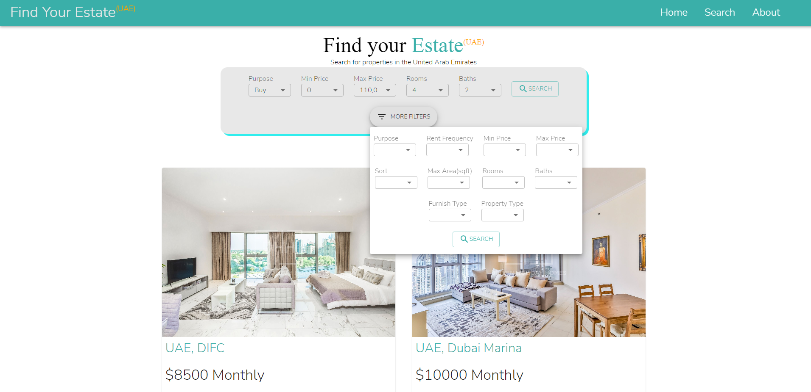

# Find Your Estate

## Description 

Find Your Estate is a real estate app where users can look for properties to rent or buy.

## How to use

You can visit the application here [https://agenta12.github.io/Find_An_Estate/](https://agenta12.github.io/Find_An_Estate/)

Click on 'search' in the navbar and fill in the filters for the estate you want to look at.

If you want to know more details about the property click the 'view details button'

## Technologies used

React

MUI

Rapid API 

